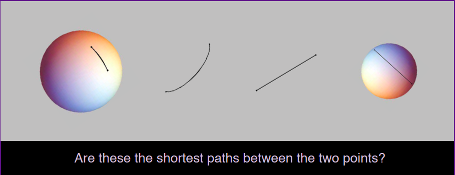
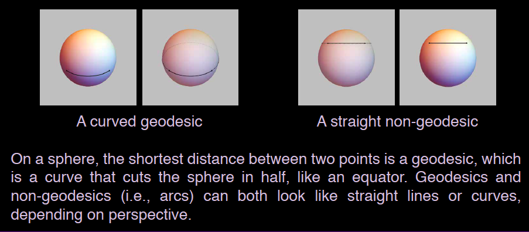
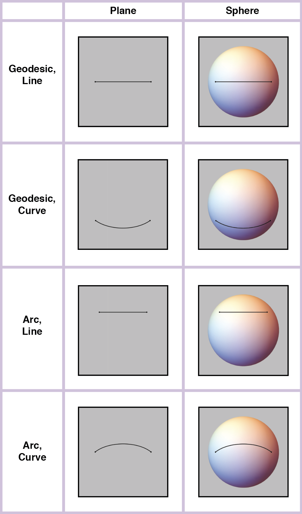

\tableofcontents

```{r setup, include = FALSE}
knitr::opts_chunk$set(
	echo = TRUE,
	message = FALSE,
	warning = FALSE
)

packages <- c("tidyverse", "magrittr", "knitr", "broom", "ggsignif", "lme4",
  "optimx", "effects", "devtools", "gtools", "ggthemes", "emmeans", "ggsignif",
  "pracma", "reghelper", "Directional")

install <- function(package){
  is_installed <- package %in% installed.packages()
  if (!is_installed) {
    install.packages(package, repos = "http://cran.us.r-project.org",
                     dependencies = TRUE, quiet = TRUE)
  }
  sapply(package, require, character.only = TRUE)
}

suppressWarnings(invisible(lapply(packages, install)))

source("code/IGEO_Summary_Helper.R")
```

# Background

## Introduction

The concept of a line, i.e., the shortest path between two points on a surface, 
is essential to our formal systems of geometry. Prior work has suggested that, 
regardless of formal education, adults have some basic intuitions about points 
and lines on both planar and spherical surfaces, although planar intuitions appear 
to be stronger (e.g., Izard et al., 2011). Further work has suggested that planar 
intuitions are not perfect (e.g., Dillon & Spelke, 2018; Hart et al., 2018) 
and that educated adults’ explicit geometric reasoning about the properties of 
points, lines, and planar figures may be affected by geometric information that 
is irrelevant to a particular judgment. For example, adults’ judgments about the 
sum of the internal angles of a planar triangle is scale dependent, whereas the 
formal rule describing this sum is scale independent (Euclid, 1990/300 BCE; 
Hart et al., 2018).

The present study explores educated adults’ intuitions about the shortest path 
between two points on pictures of planes and spheres. It examines whether the 
judgment about a path’s linearity in a picture of a sphere is affected by whether 
that same path is also a straight line on a picture of plane. It further examines 
how factors such as sphere size, line length, and magnitude of the sphere’s 
rotation, as presented in the picture, further affect this judgment. This study 
thus aims to evaluate, in our geometric intuitions, both a planar bias as well as 
an influence of geometric information that is not relevant to a linearity judgment 
in our formal systems of geometry.

## Methods

* Forty-eight adults were included in this study. They were shown pictures of paths 
on planes and spheres and asked whether the path depicts the shortest distance between 
the two points.
* An additional 26 adults participated in this study, but were excluded because of 
not meeting preregistered inclusion criteria (random responding: 15; technical 
failure: 11). One additional participant was excluded, who explicitly expressed 
that they did not follow the task directions.
* Photos differed by surface (plane vs. sphere), planar linearity (line vs. curve), 
and spherical linearity (geodesic vs. arc) for 8 total categories.
* Participants saw 28 randomly selected pictures from each category in a random order.
* Pictures also differed in path length, sphere size, sphere rotation, and each 
had a random orientation (avoiding +/-10° of the horizontal and vertical).
* Below are examples of stimuli and an explanation of the difference between
lines, curves, geodesics, and arcs.

<div style="text-align:center">
{ width=80% }
</div>

<br></br>

<div style="text-align:center">
{ width=60% }
</div>

## Conditions

There are 8 categories of stimuli. Half of these are spheres and
half are planes; the planar images are identical to the spherical ones
with the sphere made fully transparent. Collapsing across all sphere/plane pairs,
therefore, there are 4 conditions of stimuli:

* Geodesic Line (geoline)
    + A line along the equator of the sphere
* Geodesic Curve (geocurve)
    + Obtained by rotating an equator curve so that it no longer appears
  along the equator
* Arc Line (arcline)
    + A line obtained by connecting two non-equator points on the sphere at eye-level
* Arc Curve (arccurve)
    + A curve connecting two non-equator points without being a geodesic

<div style="text-align:center">
{ width=40% }
</div>

<br></br>

Let's examine each of these in turn, and explore the parameters that go into them.

### Geodesic Line

The Geo Line is the simplest of the four categories, since it consists of straight
lines along the equator of the sphere. There are therefore two parameters here:
`size` and `separation`. 

`size` controls the radius of the sphere, which is defined like this:
```{r radius}
# Size = {0, 1, 2, 3}
radius <- function(size){
   return(2*2^(size/3))
}
```

`separation` establishes the distance between the two points on the sphere. We 
start by defining the angle between the two points--the angle starts at $\frac{\pi}{9}$ 
radians then increases log-linearly until it hits $\frac{2\pi}{3}$ radians.

```{r angles}
# Separation = {0, 1, ...., 6}
min_angle <- function(separation) {
  return(-pi/2 - (pi/18)*6^(separation/6))
}

max_angle <- function(separation) {
  return(-pi/2 + (pi/18)*6^(separation/6))
}
```

The curve runs along the equator of the sphere, starting at `min_angle` and 
ending at `max_angle`. The start and endpoints are therefore defined as follows:

```{r points}
# Size = {0, 1, 2, 3}
# Separation = {0, 1, ..., 6}
left_point <- function(size, separation){
  left_x <- cos(min_angle(separation))
  left_y <- sin(min_angle(separation))
  return(radius(size)*c(left_x, left_y, 0))
}

right_point <- function(size, separation){
  right_x <- cos(max_angle(separation))
  right_y <- sin(max_angle(separation))
  return(radius(size)*c(right_x, right_y, 0))
}
```

With this in mind, we can define the distance between the two points in terms
of their angular separation (in radians) and the length of the line that joins
them:

```{r pt_distance_gl}
# Separation = {0, 1, ..., 6}
point_sep_rad <- function(separation){
  return(max_angle(separation) - min_angle(separation))
}

length_gl <- function(size, separation){
  return(point_sep_rad(separation)*radius(size))
}
```

Moreover, the height of all these points (i.e. their z-coordinate) is zero.

```{r height_gl}
height_gl <- 0
```

With 4 possible sizes and 7 possible separations, this yields a total of 28
Geodesic Line pictures. But this just includes the spherical conditions; the planar
trials are generated by making the underlying spheres transparent, which leads 
to a total of 56 images for this category.

### Geodesic Curve

The geodesic curves are nearly identical to the geodesic lines, except the
sphere is rotated by an amount specified by a new variable, `pull`, so that the
path now appears curved instead of straight.

The calculation for the rotation angle is done as follows. We specify a `back_point`,
which is a point that lies on the side of the sphere that points away from the 
viewer. If `pull` is positive, this point is below the $x$-$y$ plane. If `pull` is 
negative, it goes above the plane.

```{r backpt}
# Size = {0, 1, 2, 3}
# Pull = {-5, ..., -1, 1, ... 5}
back_point <- function(size, pull){
  back_y <- cos(pull*pi/15)
  back_z <- -sin(pull*pi/15)
  return(radius(size)*c(0, back_y, back_z))
}
```

We then rotate the sphere by an amount which would result in this `back_point`
being aligned at the same height as the `left_point` and `right_point` we defined 
before. Picture a sphere with one point marked on the backside, directly opposite 
your viewing perspective, but above the equator. Imagine two additional points along
the equator on your side of the sphere. By how much would you need to rotate the 
sphere in order for these three points to be at the same height?

The answer is somewhat tricky. We need to construct a plane that connects these
three points, then determine the angle between the plane's normal vector and the
z-axis. This angle becomes our rotation angle. We therefore define `norm_vec`
and `rot_angle` as follows:

```{r rot_angle}
# Size = {0, 1, 2, 3}
# Separation = {0, 1, ..., 6}
# Pull = {-5, ..., -1, 1, ..., 5}
norm_vec <- function(size, separation, pull){
  left_pt <- left_point(size, separation)
  right_pt <- right_point(size, separation)
  back_pt <- back_point(size, pull)
  vec_1 <- (left_pt - back_pt)
  vec_2 <- (right_pt - back_pt)
  normal <- pracma::cross(vec_1, vec_2)
  return(normal/Norm(normal)) # Unit normal
}
  
rot_angle <- function(size, separation, pull, spin = NA_integer_){
  normal <- norm_vec(size, separation, pull)
  angle <- acos(dot(normal, c(0, 0, 1)))
  ifelse(is.na(spin), angle, 1.7*spin*angle)
}
```

The height of the points is therefore:

```{r height_gc}
rot_matrix <- function(size, separation, pull, spin = NA_integer_){
  angle <- rot_angle(size, separation, pull, spin)
  return(rot.matrix(c(0, 0), theta = angle, rads = TRUE))
}

height_gc <- function(size, separation, pull){
  rotated <- rot_matrix(size, separation, pull) %*% 
    left_point(size, separation)
  return(rotated[3])
}
```

And the line length is:

```{r length_gc}
length_gc <- function(size, separation){
  return(point_sep_rad(separation)*radius(size))
}
```
There are now 4 possible `size`s, 7 possible `separation`s, 10 possible
`pull`s, and two possible surfaces, yielding a total of 560 Geodesic Lines.

### Arc Line

The arc lines are paths on the sphere which, if the sphere were to disappear,
would look like straight lines. These paths are not located on the equator,
which makes them arcs, not geodesics. If these paths were to continue all 
the way around the sphere, they'd cut off a spherical cap.

These are generated by once again specifying a `back_point` on the opposite side
of the sphere as the viewer.


```{r chord}
chord_length <- function(size, pull){
  vector <- radius(size)*c(0, -1, 0) - back_point(size, pull)
  return(Norm(vector))
}

height_al <-  function(size, pull){
  length <- radius(size)^2 - (chord_length(size, pull)/2)^2
  return(sign(pull)*sqrt(length))
}
```

The length of the curve is:
```{r length_al}
length_al <- function(size, separation, pull){
  new_radius <- chord_length(size, pull)/2
  return(new_radius*point_sep_rad(separation))
}
```

### Arc Curve

This function takes two points along the equator and creates a plane between
those two points and the `back_point`, then draws a path at the intersection of
that plane and the sphere. If `spin = 0` then this is the final output, but
if `spin = 1` then this curve is rotated by 1.7 times the angle between the plane
and the z-axis.

```{r height_ac} 
# Spin = {0, 1.7}
height_ac <- function(size, separation, pull, spin){
  rotated <- rot_matrix(size, separation, pull, spin) %*% 
    left_point(size, separation)
  return(rotated[3])
}
```

The length of the curve is slightly tricky to calculate, but it involves
knowing the formula for the intersection of a plane and a sphere. The main 
tricky step is identifying the point at the center of the circle of intersection
of the plane and the sphere.

```{r length_ac}
length_ac <- function(size, separation, pull){
  left_pt <- left_point(size, separation)
  right_pt <- right_point(size, separation)
  norm_vec <- norm_vec(size, separation, pull)
  plane_constant <- dot(left_pt, norm_vec)
  center_pt <- plane_constant*norm_vec
  to_left <- left_pt - center_pt
  to_right <- right_pt - center_pt
  new_radius <- Norm(to_left)
  arc_length <- acos(dot(to_left, to_right)/(Norm(to_left))^2)
  return(new_radius*arc_length)
}
```

# Results

Read in the data and transform to the proper format.

```{r data}
IGEO_data <- read_csv("data/IGEO_data.csv", col_types = cols())

IGEO_data %<>% 
  select(
    Subject.No., Version, order, image, Surface, Planar.Straight, 
    Spherical.Straight, Line.Length, Response, rt
    ) %>% 
  set_names(
    x = ., 
    nm = c("subject_no", "version", "order", "image", "surface",
  "planar", "spherical", "line_length", "response", "reaction_time")
    ) %>% 
  mutate_at(
  .vars = c("subject_no", "version", "order", "surface",
  "planar", "spherical", "response"), 
  .funs = factor
  ) %>% 
  mutate(response = factor(response, labels = c("incorrect", "correct"))) %>% 
  arrange(surface, desc(planar), desc(spherical))
```

We now add the relevant information about point separation, rotation angle,
height, size, and other features of the images. This is rather lengthy, but you
can click to expand.

<details>
<summary>IGEO Data Specs</summary>
```{r specs}
# Get the info about size, separation, pull, spin
IGEO_data %<>% 
  mutate(image_stripped = str_remove_all(image,
    "gPlane_|Plane_|Sphere_|gSphere_|_.jpg")) %>% 
  separate(
    col = image_stripped,
    into = c("size", "separation", "pull", "spin"),
    sep = "_",
    remove = TRUE
  ) %>% 
  mutate(pull = str_replace(pull, fixed("(Neg)"), "-")) %>% 
  mutate_at(
    .vars = c("size", "separation", "pull", "spin"),
    .funs = as.numeric
  )

# Load into the data the specifics about the height, 
# line length, rotation angle, etc.
IGEO_data %<>% 
  mutate(
    pull = replace_na(pull, 0),
    point_sep_rad = point_sep_rad(separation),
    rotation_angle = case_when(
      planar == "line" & spherical == "arc" ~ 0,
      TRUE ~ pmap(
        .l = list(size, separation, pull, spin),
        .f = rot_angle
        ) %>% unlist()
      ),
    height = by_case(
      col_1 = planar, col_2 = spherical,
      gl = 0,
      gc = pmap(.l = list(size, separation, pull), .f = height_gc) %>% unlist(),
      al = map2(.x = size, .y = pull, .f = height_al) %>% unlist(),
      ac = pmap(.l = list(size, separation, pull, spin), .f = height_ac) %>% unlist()
      ),
    height = abs(height)/radius(size),
    line_length = by_case(
      col_1 = planar, col_2 = spherical,
      gl = map2(.x = size, .y = separation, .f = length_gl) %>% unlist(),
      gc = map2(.x = size, .y = separation, .f = length_gc) %>% unlist(),
      al = pmap(.l = list(size, separation, pull), .f = length_al) %>% unlist(),
      ac = pmap(.l = list(size, separation, pull), .f = length_ac) %>% unlist()
      )
    ) %>% 
  select(everything(), response, reaction_time)

IGEO_data %>% write_csv("data/IGEO_data_updated.csv")
```
</details>

## Descriptives

Let's examine the descriptives. First, a simple question: how did participants,
in general, perform on this task?

```{r descriptives}
num_trials <- IGEO_data %>% nrow()

# Get the overall correct proportion
all_trials <- IGEO_data %>% 
  group_by(response) %>% 
  summarise(
    count = n(),
    percentage = round(count/(num_trials), 3)
    )

# Summarize
all_trials %>%
  kable(.)
```

We see that 71% of all responses were correct. Let's break this number down by 
category to see how participants did on each of the 8 types of stimuli.

```{r split}
# Break results down by category
IGEO_descriptives <- IGEO_data %>% 
  mutate(response = as.numeric(response) - 1) %>% 
  group_by(surface, spherical, planar) %>% 
  summarise(percentage_correct = mean(response)) %>% 
  mutate(condition = sprintf("%s_%s_%s", surface, spherical, planar)) %>% 
  select(everything()) %>% 
  ungroup() %>% 
  arrange(surface, desc(planar), desc(spherical))

# Summarize
IGEO_descriptives %>% 
  select(condition, percentage_correct) %>%
  kable(.)
```
    
Let's plot these descriptive results.

```{r descriptives_plot, fig.align="center"}
my_labs <- function(){
  labs(
    x = "Surface",
    y = "Proportion Correct",
    fill = " ",
    title = "Descriptives"
  )
}

IGEO_descriptives %>% 
  mutate(
    condition = sprintf("%s %s", str_to_title(spherical), str_to_title(planar)),
    condition = factor(condition, levels = unique(condition))
    ) %>% 
  ggplot(data = .,
    aes(x = str_to_title(surface), y = percentage_correct, fill = condition)) +
  geom_bar(position = position_dodge(width = NULL), stat = "identity") +
  my_labs() + IGEO_theme() + IGEO_fill()
```

Note that in all categories, participants answer correctly on average, except for 
arcs on the sphere. Participants say too frequently that the paths are the shortest
between the two points. We will explore later whether this error is caused by an
overall bias for participants to say "yes" when asked if a path on a sphere is
the shortest. 

# Analysis

Let's run some regressions! We first evaluate whether participants' responses were 
above chance. Then, we run our preregistered analyses (Models 1 & 2). For Model 1,
we include an additional post-hoc analysis (Model 1b), where we explore whether 
the results we observe in Model 1 can be explained by a "yes"-bias. We also include 
a post-hoc version of Model 2, in which we substitute one variable (a mathematical 
property of the stimuli) for another one (a pictorial property) that is closely related.

## Above Chance Model

The model is a simple binomial regression to see whether, overall, participants
perform better than chance.

```{r above_chance}
# All trials together
model_above_chance <- IGEO_data %>% 
  glmer(
    data = .,
    response ~ (1 | subject_no),
    family = binomial(link = "logit"),
    glmerControl(optimizer = "optimx", optCtrl = list(method = "nlminb"))
    )

# Take a look
model_above_chance %>%
  tidy() %>% 
  filter(term == "(Intercept)") %>% 
  mutate(term = "Intercept") %>% 
  mutate(
    p_value = "0.0000",
    p_value_clean = clean_p_val(p.value),
    p_value_star = stars.pval(p.value)
  ) %>% 
  rename(
    "std_error" = std.error,
    "log_odds" = estimate
    ) %>% 
  select(-p.value, -group) %>% 
  kable(.)
```

Overall, then, performance was significantly above chance. Let's now split this 
up by category to see how participants performed on each of the 8 types of 
questions.

```{r above_chance_split}
# Split up by category
model_above_chance_split <- IGEO_data %>% 
  group_by(surface, spherical, planar) %>% 
  do(
    above_chance = glmer(
      data = .,
      response ~ (1 | subject_no),
      family = binomial(link = "logit"),
      glmerControl(optimizer = "optimx", optCtrl = list(method = "nlminb"))
      )
    )

# Look at results
model_above_chance_split %>% 
  tidy(above_chance, conf.int = TRUE) %>% 
  ungroup() %>% 
  filter(term == "(Intercept)") %>% 
  mutate(
    p_value = round(p.value, 4),
    p_value_clean = clean_p_val(p.value),
    p_value_star = gtools::stars.pval(p_value),
    condition = sprintf("%s_%s_%s", surface, spherical, planar)
  ) %>% 
  arrange(surface, desc(planar), desc(spherical)) %>% 
  mutate(probability = 1/(1 + exp(-estimate))) %>% 
  rename(
    "std_error" = std.error,
    "log_odds" = estimate,
    "conf_lower" = conf.low,
    "conf_upper" = conf.high
    ) %>% 
  select(condition, everything(), -term, -surface, -planar, 
    -spherical, -group, -p.value) %>% 
  kable(.)
```

We note that the performance is significantly different from chance 
in all cases, with `p < 0.001` in all cases except`sphere_arc_line`, which has
`p < 0.01`. We note as well that, as seen from the descriptives, the performance
for `sphere_arc_line` and `sphere_arc_curve` were both significantly below chance.

## Model 1

Our first preregistered model examines the main effects of the surface (plane 
vs. sphere), the planar linearity (line vs. curve), and the spherical linearity 
(geodesic vs. arc), as well as all of the possible interaction effects among 
these variables. 

### Preditions

In our preregistered hypotheses, we predicted the following main 
effects:

* Surface: responses will be more accurate for pictures of planes then pictures of spheres
* Planar linearity: responses will be more accurate for lines than curves
* Spherical linearity: responses will be more accurate for geodesics than arcs

In addition, we predicted a significant interaction between the surface and spherical
linearity. While there might be no difference between responses to geodesics versus 
arcs on pictures of planes, responses might be more accurate for geodesics versus 
arcs on pictures of spheres. Finally, we predicted a three-way interaction: arc curves
should be more difficult to identify on spheres than on planes.

### Running the Model

```{r model_1}
model_1 <- glmer(
  data = IGEO_data,
  formula = response ~ surface * planar * spherical + (1 + surface + planar | subject_no),
  family = binomial(link = "logit"),
  glmerControl(optimizer = "optimx", optCtrl = list(method = "nlminb"))
  )

# Show the results
clean_IGEO_model(
  model = model_1,
  col_names = c("Intercept", "Surface", "Planar", "Spherical",
    "Surface x Planar", "Surface x Spherical", "Planar x Spherical",
    "Surface x Planar x Spherical")
)
```

As predicted, there is a main effect of `Surface`, `Planar`, and `Spherical`.
The only non-significant terms in this analysis are `Spherical` and `Planar x Spherical`. 
This means that the spherical straightness (geodesic vs. arc) affects performance
only in the presence of the `Surface` term---that is, the geodesic vs. arc distinction
makes no difference if `Surface == "plane"`, but makes a big difference if
`Surface == "sphere"`, just as we predicted.

Moreover, as expected, there is a significant `Surface x Planar x Spherical` effect, 
indicating that an arc curve on a sphere is more difficult to identify than an 
arc curve on a plane.

### Marginal Means

We now examine the model's predicted values for each of the 8 conditions, i.e., 
the marginal means.

```{r model_1_predicted}
# Estimated Marginal Means
model_1_predicted <- emmeans(
  object = model_1, 
  specs = ~ surface * planar * spherical , 
  type = "response"
  )

model_1_predicted_clean <- clean_IGEO_emmeans(model_1_predicted)

model_1_predicted_clean %>% 
  kable()
```

Here is a plot of these model predictions.

<details>
<summary>Model 1 plot code</summary>
```{r plot_model_1_code}
my_labs <- function(){
  labs(
    x = "Surface",
    y = "Predicted Proportion Correct",
    fill = " ",
    title = "Model 1 Predictions"
  )
}

model_1_plot <- model_1_predicted_clean %>% 
   mutate(
      condition = sprintf("%s %s", str_to_title(spherical), str_to_title(planar)),
      condition = factor(condition, levels = unique(condition))
    ) %>%   
  ggplot(data = ., aes(x = str_to_title(surface), y = probability, fill = condition)) +
  geom_bar(position = position_dodge(width = NULL), stat = "identity") +
  geom_errorbar(aes(ymin = conf_lower, ymax = conf_upper), 
    position = position_dodge(0.9), width = 0.2, size = 0.4) +
  my_labs() + IGEO_theme() + IGEO_fill()
```
</details>

```{r plot_model_1, fig.align = "center"}
model_1_plot
```

This plot looks a great deal like the graph of the descriptives for each, but
it was generated by an explanatory model which we can use to better understand 
these data. 

### Contrasts

We now look at the contrasts in order to explore which differences 
between categories are significant. All contrasts are holm-adjusted to correct
for multiple comparisons.

```{r model_1_contrasts}
# Compute contrasts
contrast(
  object = model_1_predicted, 
  by = c("surface"), 
  method = "pairwise", 
  adjust = "holm"
  ) %>% 
  clean_IGEO_contrasts()
```

Participants were more accurate with geodesic lines than they were with
geodesic curves. 

## Model 1b

In this variant of the first model, we will explore whether participants’ correct 
responding to geodesics on spheres is a byproduct of their responding “yes” to all 
trials on spheres. Because participants performed below chance on both arc categories 
on spheres (i.e., responded “yes” too often when the correct answer was “no”), 
we will evaluate whether the proportion of “yes” responses in the geodesic 
categories is significantly greater than the “yes” responses in the arc categories.

Note that this is a post-hoc analysis which was not specified in the original 
preregistration but is helpful to understand the below chance responses for arcs 
on spheres. We’re also only running the model on spheres, since there was no below 
chance responding for planes.

Before we proceed, let’s ask the question: did any given participant answer “yes” 
to more than 90% of the stimuli across the whole experiment? Future versions of 
this experiment are using this threshold as an exclusion criterion, so it is 
worth investigating here.

```{r correct_ans}
# Info about the correct answer for each condition
IGEO_correct <- IGEO_descriptives %>% 
  select(surface, spherical, planar) %>% 
  mutate(
    correct_ans = c("yes", "yes", "no", "no", "yes", "no", "yes", "no"),
    correct_ans = factor(correct_ans)
  )

# Add correct_ans info to IGEO_data
IGEO_data %<>% 
  left_join(IGEO_correct, by = c("surface", "spherical", "planar")) %>% 
  mutate(
    given_ans = case_when(
      response == "correct" & correct_ans == "yes" ~ "yes",
      response == "correct" & correct_ans == "no" ~ "no",
      response == "incorrect" & correct_ans == "yes" ~ "no",
      response == "incorrect" & correct_ans == "no" ~ "yes"
    ),
    given_ans = factor(given_ans)
  )

IGEO_data %>% 
  group_by(subject_no) %>% 
  summarise(
    percentage_yes = mean(given_ans == "yes")
  ) %>% 
  arrange(desc(percentage_yes)) %>% 
  head() %>% 
  kable()
```

No participant gave more than 80% “yes” answers.
 
We now rerun the exact same equation from Model 1, but this time using the
given answer (yes vs. no) as the dependent variable, instead of whether the answer
was correct or incorrect.

```{r model_1b}
model_1b <- IGEO_data %>% 
  filter(surface == "sphere") %>% 
  glmer(
    data = .,
    formula = given_ans ~ planar * spherical + (1 + planar | subject_no),
    family = binomial(link = "logit"),
    glmerControl(optimizer = "optimx", optCtrl = list(method = "nlminb"))
  )

# Show the results
clean_IGEO_model(
  model = model_1b,
  col_names =  c("Intercept", "Planar", "Spherical", "Planar x Spherical")
  )
```

### Marginal Means

We now examine the marginal means for yes/no responses across the 4 spherical 
categories.


```{r model_1b_predicted}
# Estimated Marginal Means
model_1b_predicted <- emmeans(
    object = model_1b,
    specs = ~ planar * spherical , 
    type = "response"
  )

model_1b_predicted_clean <- model_1b_predicted %>% 
  tidy() %>% 
  select(-df) %>% 
  rename(
    "std_error" = std.error,
    "probability" = prob
    ) %>% 
  mutate(
    conf_lower = probability - 1.96*std_error,
    conf_upper = probability + 1.96*std_error
  ) %>% 
  arrange(desc(planar), desc(spherical)) %>% 
  mutate(surface = "sphere") %>% 
  select(surface, everything(), -asymp.LCL, -asymp.UCL)

model_1b_predicted_clean %>% 
  kable()
```

Finally, we plot this model's predictions.

<details>
<summary>Model 1b Plot Code</summary>
```{r plot_model_1b_code}
my_labs <- function(){
  labs(
    x = "Condition",
    y = "Predicted Proportion of\n \"Yes\" Responses",
    fill = " ",
    title = "Model 1b Predictions"
  )
}


model_1b_graph <- model_1b_predicted_clean %>% 
  mutate(
    condition = sprintf("%s %s", str_to_title(spherical), str_to_title(planar)),
    condition = factor(condition, levels = unique(condition))
    ) %>% 
  ggplot(data = .,
    aes(x = condition, y = probability, fill = condition)) +
  geom_bar(position = position_dodge(width = NULL), stat = "identity") +
  geom_errorbar(aes(ymin = conf_lower, ymax = conf_upper), 
    position = position_dodge(0.9), width = 0.2, size = 0.4) +
  my_labs() + IGEO_theme() + IGEO_fill() + 
  guides(fill = FALSE)
```
</details>

```{r plot_model_1b, fig.align = "center"}
model_1b_graph
```

### Contrasts

We now look at the contrasts in order to explore which differences 
between categories are significant. All contrasts are holm-adjusted to correct
for multiple comparisons.

```{r model_1b_contrasts}
# Compute contrasts
contrast(
  object = model_1b_predicted, 
  method = "pairwise",
  by = c("planar"),
  adjust = "holm"
  ) %>% 
  tidy() %>% 
  mutate(
    p_value = round(p.value, 4),
    p_value_clean = clean_p_val(p.value),
    p_value_star = stars.pval(p.value)
    ) %>% 
  rename(
    "odds_ratio" = odds.ratio,
    "std_error" = std.error
    ) %>%
  select(planar, everything(), -p.value, -z.ratio, -df) %>% 
  kable()
```

Participants say "yes" to pictures of curves on spheres equally frequently for
arcs and geodesics, but are able to discriminate between the two categories
for lines on spheres.

## Model 2

We now move onto our second preregistered model, which just looks at spheres. 
This model goes beyond the properties of the surface and explores other properties, 
such as the length of the path and the size of the sphere.

In the preregistration document, Model 2 was based on the following equation:
```{r model_2_initial, eval = FALSE}
# Not run
glmer(
  formula = response ~ planar * spherical + size + line_length + pull + 
    planar * pull + spherical * pull + (1 + planar | subject_no),
  family = binomial(link = "logit"),
  glmerControl(optimizer = "optimx", optCtrl = list(method = "nlminb"))
)
```

We predicted that `pull`---which controls the distance of the center of the
curve from the equator---might affect accuracy. That is, we anticipated that participants
would give more incorrect answers for paths that are far from the equator. In addition, 
we predicted that there might be a `Pull x Spherical` interaction with `pull` making 
geodesics harder to identify and arcs easier to identify.

However, this model failed to converge. We therefore removed the random slope for 
the planar condition, and also eliminated the `planar * pull` and `planar * spherical`
interaction terms because they were not needed to address our registered hypotheses. 
Moreover, due to confusion about ambiguous variable names, we renamed `pull` to
`rotation_angle`. Thus, the updated Model 2 is the following:

```{r model_2_updated}
model_2 <- IGEO_data %>% 
  filter(surface == "sphere") %>% 
  glmer(
    data = .,
    formula = response ~ size + line_length + planar + 
      spherical * rotation_angle + (1 | subject_no),
    family = binomial(link = "logit"),
    glmerControl(optimizer = "optimx", optCtrl = list(method = "nlminb"))
    )

clean_IGEO_model(
  model = model_2,
  col_names = c("Intercept", "Size", "Line Length", "Rotation Angle",
    "Spherical", "Planar", "Rotation Angle x Spherical")
)
```

We predicted that `Rotation Angle`---which controls the distance of the center of the
curve from the equator---might affect accuracy. That is, we anticipated that participants
would give more incorrect answers for paths that are far from the equator. In addition, 
we predicted that there might be a `Rotation Angle x Spherical` interaction with 
`Rotation Angle` making geodesics harder to identify and arcs easier to identify.

Contrary to our prediction, `Rotation Angle` by itself did not significantly 
affect accuracy. However, there was a significant `Rotation Angle x Spherical` interaction. 
Given the negative coefficient, we interpret this as saying that for higher values 
of `Rotation Angle` and for geodesics, participants are less likely to answer correctly. 
This supports our hypothesis that `Rotation Angle` makes geodesics more difficult 
to identify and arcs easier to identify.

We also note that there is a significant effect of `Size` with a negative coefficent,
implying that answers are more accurate for smaller spheres.

### Simple Slopes for Model 2

Let's explore in further detail the effect of `rotation_angle` on each of the levels
of `spherical` by looking at the magnitude of `rotation_angle`'s effect on
geodesics vs. arcs.

```{r model_2_simple_slope}
IGEO_data %>%
  filter(surface == "sphere") %>% 
  mutate(
    rotation_angle_centered = scale(rotation_angle, scale = FALSE),
    rotation_angle_geo = rotation_angle_centered*(spherical == "geo"),
    rotation_angle_arc = rotation_angle_centered*(spherical == "arc")
    ) %>% 
  glmer(
    data = .,
    formula = response ~ size + line_length + planar + 
      spherical + rotation_angle_geo + rotation_angle_arc + (1 | subject_no),
    family = binomial(link = "logit"),
    glmerControl(optimizer = "optimx", optCtrl = list(method = "nlminb"))
  ) %>% 
  clean_IGEO_model(
    model = .,
    col_names = c("Intercept", "Size", "Line Length", "Planar", "Spherical",
      "Rotation Angle on Geos", "Rotation Angle on Arcs")
  )
```

In keeping with our predictions and previous observations, we see that `rotation_angle`
differentially affects geodesicss vs. arcs. Increased `rotation_angle` makes geodesics 
significantly harder to identify, though there was no significant effect for arcs.

Note that we would obtain a qualitatively identical outcome if we examined 
the height of the points on the depicted sphere instead of the calculated rotaion angle. 
The angle of rotation and the height, while not precisely equal, are related by 
a simple `sin()` or `cos()` function. We will examine this in the next section.

### Model 2 With Height

We now modify Model 2 slightly by looking at the absolute height of the points
(where 0 means on the equator and 1 means at the north or south pole) instead of 
the rotation angle.

```{r model_2_height}
model_2_height <- IGEO_data %>% 
  filter(surface == "sphere") %>% 
  glmer(
    data = .,
    formula = response ~ size + line_length + planar + 
      spherical * height + (1 | subject_no),
    family = binomial(link = "logit"),
    glmerControl(optimizer = "optimx", optCtrl = list(method = "nlminb"))
    )

clean_IGEO_model(
  model = model_2_height,
  col_names = c("Intercept", "Size", "Line Length", "Height",
    "Spherical", "Planar", "Height x Spherical")
)
```


```{r model_2_height_simple_slope}
IGEO_data %>%
  filter(surface == "sphere") %>% 
  mutate(
    height_centered = scale(height, scale = FALSE),
    height_geo = height_centered*(spherical == "geo"),
    height_arc = height_centered*(spherical == "arc")
    ) %>% 
  glmer(
    data = .,
    formula = response ~ size + line_length + planar + 
      spherical + height_geo + height_arc + (1 | subject_no),
    family = binomial(link = "logit"),
    glmerControl(optimizer = "optimx", optCtrl = list(method = "nlminb"))
  ) %>% 
  clean_IGEO_model(
    model = .,
    col_names = c("Intercept", "Size", "Line Length", "Planar", "Spherical",
      "Height on Geos", "Height on Arcs")
  )
```

Here we see a small difference between `height` and `rotation_angle`, in the
sign of the non-effect of height on arcs. But because this term is not significant 
either way, we interpret this variation as being due to chance.

We can now plot the height vs. accuracy to better see how `height` differentially 
affects geodesics and arcs:

<details>
<summary>Height plot code</summary>
```{r plot_model_2, fig.align = "center"}
# Turn height responses into bins for plotting
height_descriptives <- IGEO_data %>% 
  filter(surface == "sphere") %>% 
  group_by(height, spherical) %>% 
  summarise(percent_correct = mean(as.numeric(response)) - 1) %>% 
  ungroup(height, spherical) %>% 
  mutate(bins = cut(height, 20)) %>% 
  group_by(bins, spherical) %>% 
  summarise(correct = mean(percent_correct)) %>% 
  ungroup(bins, spherical) %>% 
  separate(bins, c("pre_comma", "post_comma"), sep = ",") %>% 
  mutate(
    pre_comma = as.numeric(str_remove(pre_comma, fixed("("))),
    post_comma = as.numeric(str_remove(post_comma, fixed("]"))),
    height = (pre_comma + post_comma)/2
  ) %>% 
  select(height, spherical, correct)

my_labs <- function(){
  labs(
    x = "Height",
    y = "Accuracy",
    color = " ",
    title = "The Effect of Height on Accuracy"
  )
}

height_plot <- height_descriptives %>% 
  mutate(spherical = factor(spherical, labels = c("Arc", "Geodesic")),
    spherical = fct_relevel(spherical, "Geodesic", "Arc")) %>% 
  ggplot(data = ., aes(x = height, y = correct, color = spherical)) +
  geom_jitter() + scale_y_continuous(limits = c(0, 0.85)) + 
  scale_x_continuous(limits = c(0, 0.81)) +
  IGEO_theme() + IGEO_colors() + my_labs()
```
</details>

```{r height_plot, fig.align = "center"}
height_plot
```

Note that, as per our model, there is a consistent downward trend for geodesics,
but less of a clear trend for arcs (hence why the latter is not significant).
This accounts for the significant `Height x Spherical` interaction effect.

# References {-}

Dillon, M., & Spelke, E. (2018). From map reading to geometric intuitions. 
*Developmental Psychology, 54(7)*, 1304–1316.

Euclid. (1990). *Great Books of the Western World: The thirteen books of Euclid’s* 
Elements. *The works of Archimedes, including *The Method.* Introduction to *Arithmetic
*by Nicomachus* (2 ed.). Chicago: Encyclopedia Britannica. (Original work written 300 B.C.E.).

Hart, Y., Dillon, M., Marantan, A., Cardenas, A., Spelke, E., & Mahadevan. (2018). 
The statistical shape of geometric reasoning. *Scientific Reports, 8(1)*, 12906.

Izard, V., Pica, P., Spelke, E. S., & Dehaene, S. (2011). Flexible intuitions of Euclidean geometry in an Amazonian indigene group. *Proceedings of the National Academy of Sciences of the United States of America, 108(24)*, 9782-9787.
